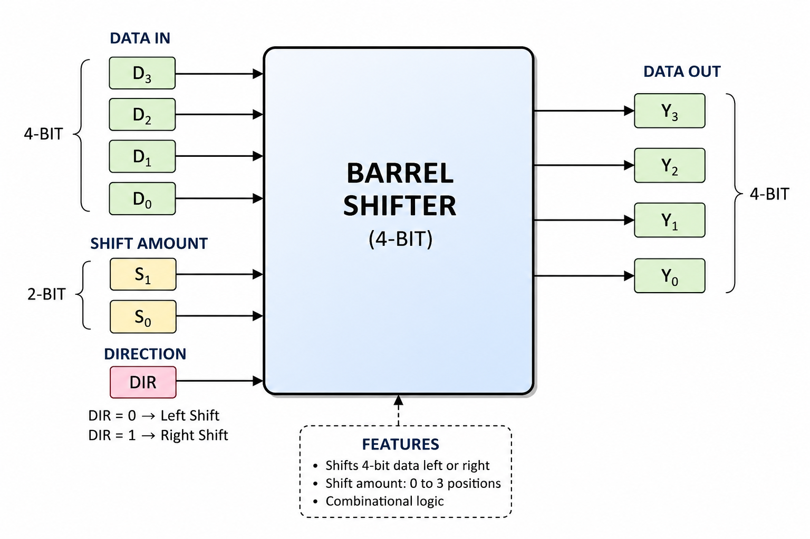

# Barrel Shifter (brlshft64)

## Description

The Barrel Shifter is a combinational digital IP that shifts a 4-bit binary input left or right by a specified number of bit positions in a single operation. It is commonly used in processors, ALUs, and DSP applications for high-speed shift operations.

## Block Diagram

## Working Principle

The input data is shifted according to the selected shift amount. Since the design is purely combinational, the shifted output is produced immediately without requiring multiple clock cycles.

## Simulation

The design was verified using eSim with Verilog HDL. Simulation confirmed correct operation for different input values and shift amounts.

## Applications

- Arithmetic Logic Units (ALUs)
- Processors
- Digital Signal Processing
- FPGA and ASIC designs
- Embedded systems

## Author

**Farhana N S**

B.Tech Electronics and Communication Engineering

Thangal Kunju Musaliar College of Engineering (TKMCE)
