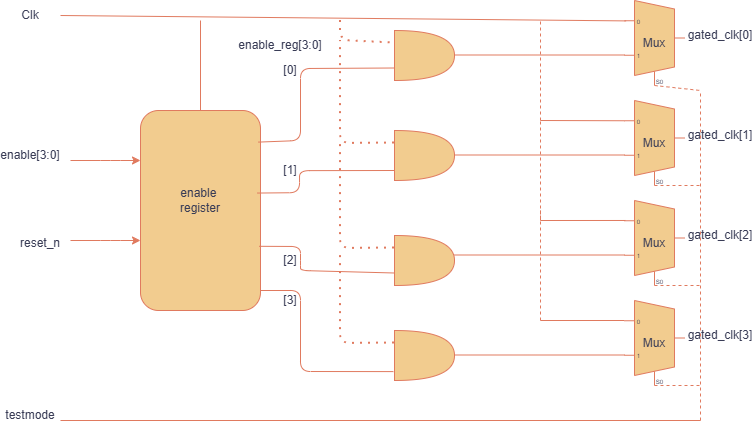

# clkgatectrl

## Description

This IP implements a Clock Gating Controller in Verilog.

The controller generates gated clocks based on enable signals. A test mode is included to bypass clock gating and directly pass the clock for testing purposes.

## Inputs

* clk : Input clock
* rst_n : Active-low reset
* enable[3:0] : Enable signals for clock gating
* test_mode : Test mode enable

## Outputs

* gated_clk[3:0] : Gated clock outputs

## Block Diagram

## Files Included

* Verilog source file
* eSim test circuit project files

## Author

Yamini
