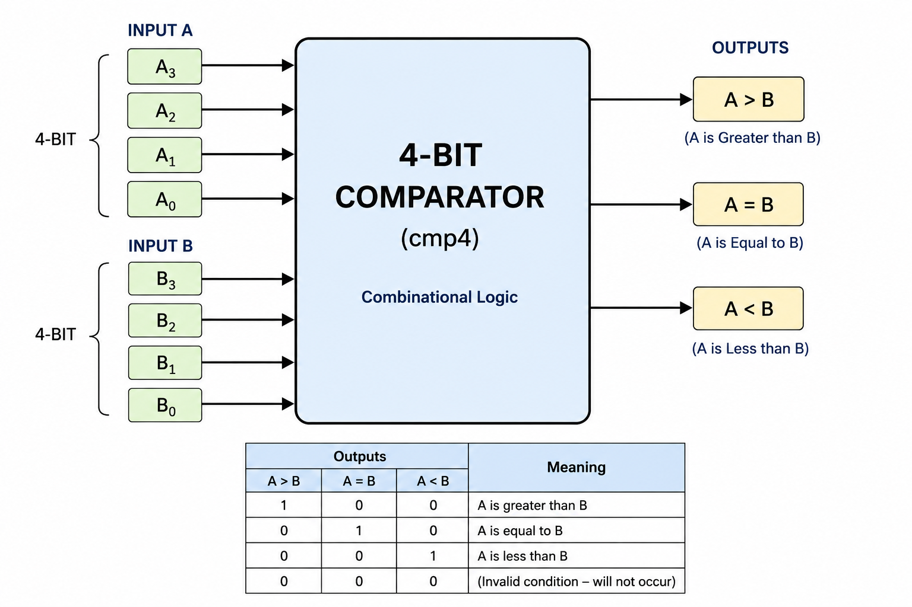

# 4-Bit Comparator (cmp83)

## Description

The 4-Bit Comparator is a combinational digital IP that compares two 4-bit binary numbers and determines their relationship. It generates outputs indicating whether the first input is greater than, equal to, or less than the second input. This IP is commonly used in arithmetic logic units (ALUs), processors, and digital decision-making circuits.

## Block Diagram

## Working Principle

The comparator accepts two 4-bit binary inputs, A and B. Using combinational logic, it compares the two values and asserts one of three outputs: A > B, A = B, or A < B. Only one output is active at any given time.

## Simulation

The design was implemented in Verilog HDL and verified using eSim with NgVeri/ngspice. Simulation confirms correct comparison results for various combinations of input values.

## Applications

- Arithmetic Logic Units (ALUs)
- Digital processors
- Control and decision-making circuits
- FPGA and ASIC designs
- Embedded systems

## Author

**N S Farhana**

B.Tech Electronics and Communication Engineering

Thangal Kunju Musaliar College of Engineering (TKMCE)
