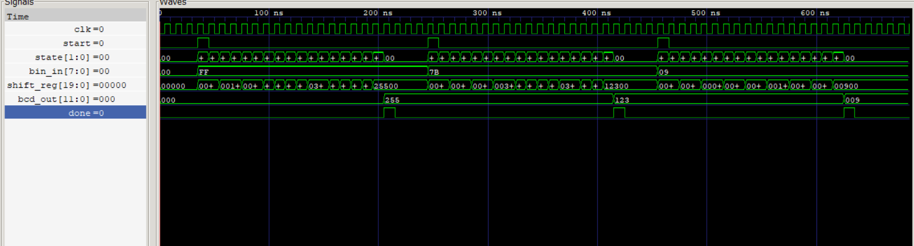

# ddbcd1113
## Description

This IP implements the Double Dabble algorithm (shift-and-add-3) in Verilog to convert an 8-bit binary number (0-255) to its Binary Coded Decimal (BCD) representation.
## Inputs

* `clk` : System clock
* `rst_n` : Active-low asynchronous reset
* `start` : Start strobe signal (pulse high for 1 clock cycle to begin conversion)
* `bin_in[7:0]` : 8-bit binary input data (0-255)

## Outputs

* `bcd_out[11:0]` : 12-bit BCD output representing Hundreds, Tens, and Ones
* `done` : Output flag indicating conversion complete (goes high when done)

## Simulation Waves

## Files Included

* Verilog source files
* eSim test circuit project files

## Author

Thejesh Varma
