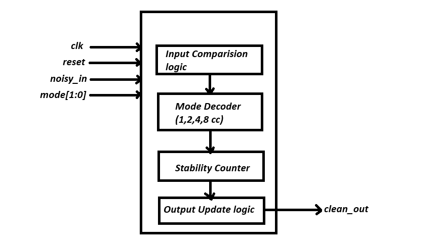

# debctrl

## Description

This IP implements a Debounce Controller in Verilog.

The controller filters noisy input signals such as push-button inputs and produces a stable clean output signal after a configurable number of stable clock cycles.

## Features

* Noise filtering for digital inputs
* Configurable debounce timing
* Multiple stability modes
* Stable output generation
* Reset support

## Inputs

* clk : System clock
* reset : Reset signal
* noisy_in : Noisy input signal
* mode[1:0] : Debounce mode selection

## Modes

* 00 : 1 stable cycle
* 01 : 2 stable cycles
* 10 : 4 stable cycles
* 11 : 8 stable cycles

## Outputs

* clean_out : Debounced stable output signal

## Operation

The module monitors the input signal and updates the output only after the input remains stable for the selected number of clock cycles.

## Block Diagram

## Files Included

* Verilog source file
* eSim test circuit project files

## Author

Yamini
