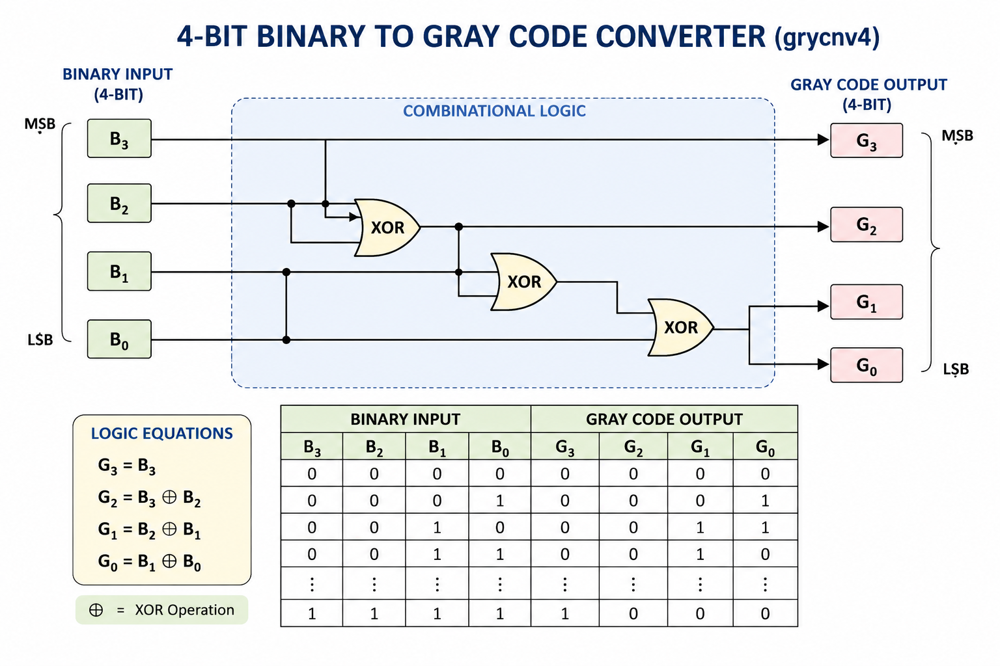

# Gray Code Converter (grycnv44)

## Description

The Gray Code Converter is a combinational digital IP that converts a 4-bit binary number into its equivalent Gray code. Gray code is widely used in digital systems because only one bit changes between successive values, reducing transition errors in high-speed and noisy environments.

## Block Diagram

## Working Principle

The converter accepts a 4-bit binary input and produces the corresponding Gray code output using combinational logic. The most significant bit (MSB) remains unchanged, while each remaining Gray code bit is generated by performing an XOR operation on two adjacent binary bits.

## Simulation

The design was implemented in Verilog HDL and verified using eSim with NgVeri/ngspice. Simulation confirms correct Gray code generation for different binary input combinations.

## Applications

- Rotary encoders
- Position sensors
- Digital communication systems
- FPGA and ASIC designs
- Error reduction in digital systems

## Author

**N S Farhana**

B.Tech Electronics and Communication Engineering

Thangal Kunju Musaliar College of Engineering (TKMCE)
