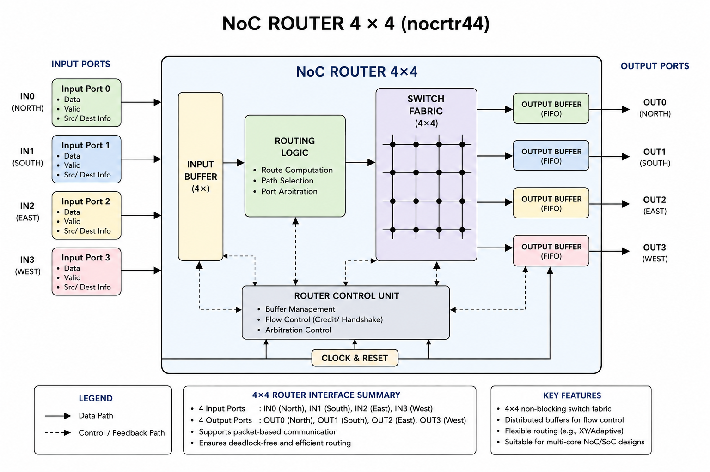

# NoC Router 4×4 (nocrtr4636)

## Description

The NoC (Network-on-Chip) Router 4×4 is a digital IP that routes data packets between interconnected processing elements in a Network-on-Chip architecture. It provides efficient communication by directing incoming packets to the appropriate output ports based on routing information, making it suitable for multi-core processors and System-on-Chip (SoC) designs.

## Block Diagram

## Working Principle

The router receives packets from its input ports, determines the appropriate destination using the routing logic, and forwards each packet to the corresponding output port. This enables reliable and efficient communication between multiple processing elements while minimizing routing conflicts and improving overall system performance.

## Simulation

The design was implemented in Verilog HDL and verified using eSim with NgVeri/ngspice. Simulation confirms correct packet routing, port selection, and reliable data transfer between the input and output ports.

## Applications

- Network-on-Chip (NoC) architectures
- Multi-core processors
- System-on-Chip (SoC) designs
- FPGA and ASIC implementations
- High-performance embedded systems

## Author

**N S Farhana**

B.Tech Electronics and Communication Engineering

Thangal Kunju Musaliar College of Engineering (TKMCE)
