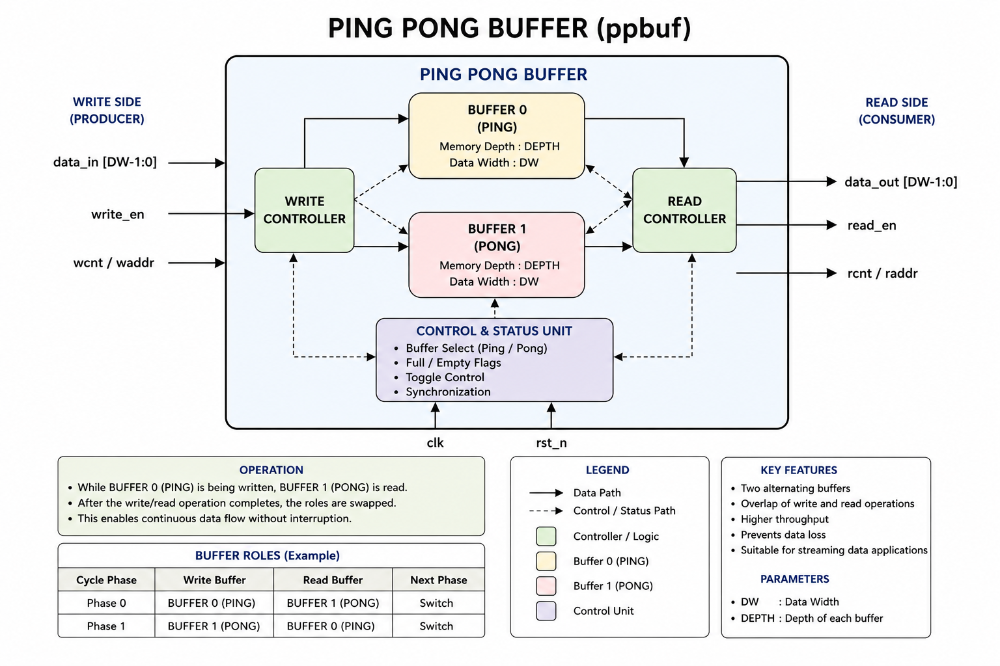

# Ping Pong Buffer (ppbuf113)

## Description

The Ping Pong Buffer is a digital memory buffering IP that uses two alternating buffers to enable continuous data transfer between a producer and a consumer. While one buffer is being written with new data, the other buffer is simultaneously read, thereby improving throughput and preventing data loss in streaming applications.

## Block Diagram

## Working Principle

The Ping Pong Buffer consists of two memory buffers that operate alternately. While one buffer is used for writing incoming data, the other is available for reading previously stored data. After the current operation completes, the roles of the buffers are exchanged, enabling uninterrupted data flow and improving system efficiency.

## Simulation

The design was implemented in Verilog HDL and verified using eSim with NgVeri/ngspice. Simulation confirms correct buffer switching, continuous data transfer, and proper synchronization between read and write operations.

## Applications

- Digital Signal Processing (DSP)
- Video and audio streaming
- High-speed data acquisition systems
- FPGA and ASIC designs
- Embedded systems

## Author

**N S Farhana**

B.Tech Electronics and Communication Engineering

Thangal Kunju Musaliar College of Engineering (TKMCE)
