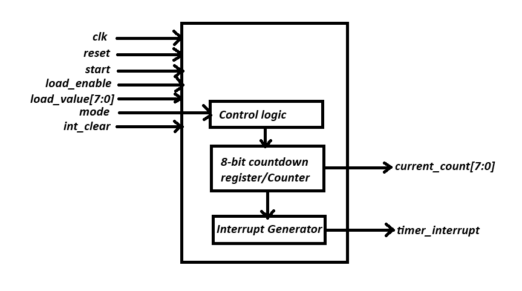

# progtimer8

## Description

This IP implements an 8-bit Programmable Timer in Verilog.

The timer supports one-shot mode and periodic mode operation. A programmable load value can be configured, and the timer generates an interrupt signal when the counter reaches zero.

## Features

* 8-bit programmable counter
* One-shot timer mode
* Periodic timer mode
* Interrupt generation
* Loadable counter value
* Interrupt clear support

## Inputs

* clk : System clock
* reset : Reset signal
* start : Start timer
* load_enable : Enable loading of timer value
* load_value[7:0] : Timer preload value
* mode : Timer mode (0 = one-shot, 1 = periodic)
* int_clear : Clear interrupt signal

## Outputs

* timer_interrupt : Timer interrupt output
* current_count[7:0] : Current counter value

## Block Diagram

## Files Included

* Verilog source file
* eSim test circuit project files

## Author

Yamini
