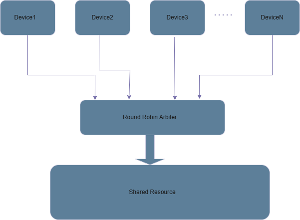

# rrarb4

## Description

This IP implements a 4-request Round Robin Arbiter in Verilog.

The arbiter grants access to one requester at a time using a round robin scheduling algorithm to ensure fair access among all requesters.

## Features

* 4-input arbitration
* Fair round robin scheduling
* Rotating priority mechanism
* Grant signal generation
* Reset support

## Inputs

* clk : System clock
* reset : Reset signal
* req[3:0] : Request input signals

## Outputs

* grant[3:0] : Grant output signals

## Operation

The arbiter checks request signals based on the current pointer position and grants access to the next active requester in round robin order. After each successful grant, the priority pointer rotates to ensure fairness.

## Block Diagram

## Files Included

* Verilog source file
* eSim test circuit project files

## Author

Yamini
