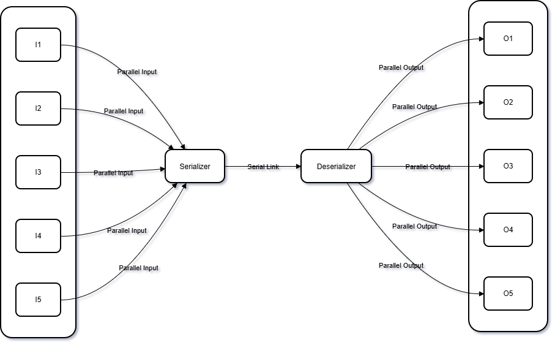

# serdes4

## Description

This IP implements a 4-bit Serializer and Deserializer (SERDES) in Verilog.

The serializer converts 4-bit parallel input data into serial data output. The deserializer receives serial data and reconstructs the original 4-bit parallel data.

## Features

* 4-bit parallel-to-serial conversion
* 4-bit serial-to-parallel conversion
* Shift register based design
* Transmission complete indication
* Reset support

## Serializer Inputs

* clk : System clock
* rst : Reset signal
* load : Load parallel data
* data_in[3:0] : Parallel input data

## Serializer Outputs

* serial_out : Serial data output
* done : Transmission complete signal

## Deserializer Inputs

* clk : System clock
* rst : Reset signal
* start : Start deserialization
* serial_in : Serial input data

## Deserializer Outputs

* data_out[3:0] : Parallel output data
* done : Reception complete signal

## Block Diagram

## Files Included

* Serializer Verilog source file
* Deserializer Verilog source file
* eSim test circuit project files

## Author

Yamini
