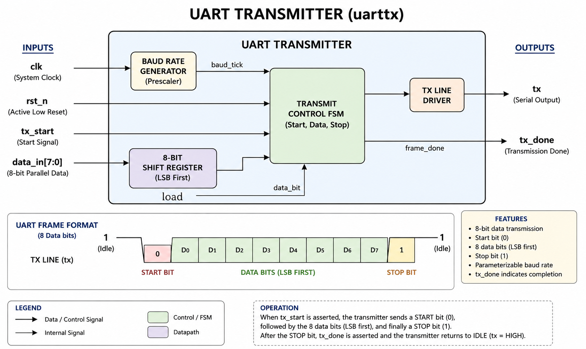

# UART Transmitter (uarttx112)

## Description

The UART Transmitter is a digital communication IP that converts 8-bit parallel data into a serial data stream using the Universal Asynchronous Receiver Transmitter (UART) protocol. It generates a start bit, transmits the data bits (LSB first), and appends a stop bit to complete the frame.

## Block Diagram

## Working Principle

The transmitter remains idle with the TX line HIGH. When `tx_start` is asserted, a LOW start bit is transmitted, followed by the 8-bit input data beginning with the least significant bit (LSB). Finally, a HIGH stop bit is transmitted and the `tx_done` signal is asserted to indicate successful completion.

## Simulation

The UART Transmitter was implemented in Verilog HDL and verified using eSim with NgVeri/ngspice. Simulation confirms correct start-bit generation, serial transmission of data bits, stop-bit generation, and assertion of the `tx_done` signal.

## Applications

- Embedded systems
- UART communication interfaces
- FPGA and ASIC designs
- Serial peripherals
- IoT devices

## Author

**N S Farhana**

B.Tech Electronics and Communication Engineering

Thangal Kunju Musaliar College of Engineering (TKMCE)