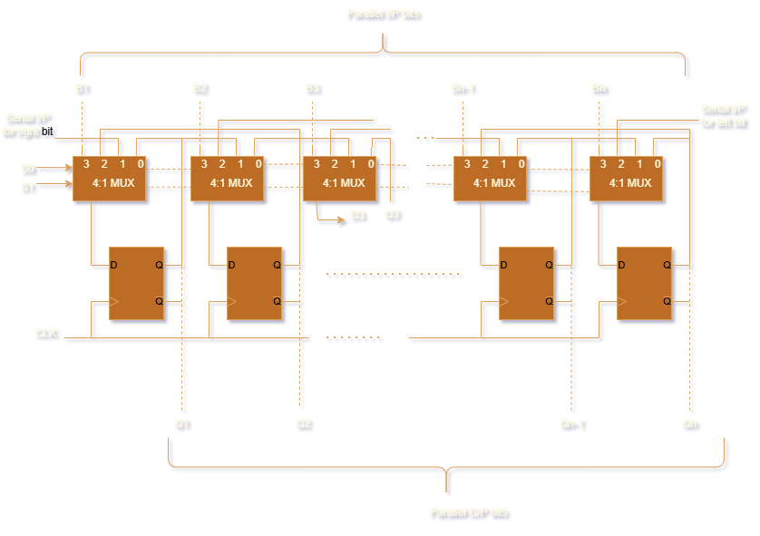

# usr8

## Description

This IP implements an 8-bit Universal Shift Register in Verilog.

The shift register supports multiple operating modes including hold, shift left, shift right, and parallel load. Serial data can be shifted in from both directions and serial output is generated during shift operations.

## Features

* 8-bit universal shift register
* Hold operation
* Shift left operation
* Shift right operation
* Parallel data loading
* Serial data output
* Reset support

## Inputs

* clk : System clock
* rst : Active-low reset signal
* parallel_in[7:0] : Parallel input data
* left_bit : Serial input for left shift
* right_bit : Serial input for right shift
* mode[1:0] : Operation mode selection

## Modes

* 00 : Hold
* 01 : Shift Left
* 10 : Shift Right
* 11 : Parallel Load

## Outputs

* parallel_out[7:0] : Parallel register output
* serial_out : Serial output data

## Block Diagram

## Files Included

* Verilog source file
* eSim test circuit project files

## Author

Yamini
